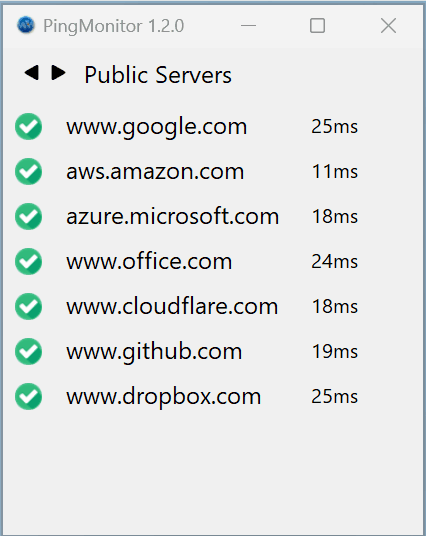

#  PingMonitor

PingMonitor is a lightweight Windows application that monitors the availability of multiple hosts by periodically pinging them. It is designed for simplicity and efficiency, making it ideal for both network administrators and casual users.

## Features

- **Host Monitoring**: Monitors multiple hosts in real-time by sending periodic ping requests.
- **Response Time Display**: Shows the response time (in milliseconds) for each host, enabling users to monitor network performance and identify slow connections.
- **Retry Mechanism**: Retries failed ping requests to ensure reliability.
- **Customizable Settings**:
  - Ping interval
  - Retry count
  - Ping timeout
  - Font family
  - Font size
  - Address family preference
- **Visual Feedback**: Displays the status of each host with a green (reachable) or red (unreachable) indicator.
- **Group Switching**: Instantly switch between different host groups with no delays, allowing for seamless monitoring of multiple networks.
- **Resizable UI**: Saves the window size and position between sessions.
- **Multi-language Support**: Available in multiple languages, including English, Chinese (Simplified), French, German, and Portuguese (Brazil), making it accessible to a global audience.

## Installation

### Download Pre-built Executable

Pre-built executable for Windows is available on the Release page.

1. Download the latest release from the [Releases](https://github.com/led-mirage/PingMonitor/releases) page.
2. Extract the zip file to your desired location.
3. Run `PingMonitor.exe`.

💡 Note:  
- If Windows Defender or other antivirus software flags the executable, please refer to the VirusTotal Scan Result for more information.
- **Before updating to a new version, please backup your hosts.txt file to avoid overwriting any custom configurations.**
- **The PingMonitor.dll.config (App.config) file may contain important updates in new versions. If you have customized this file, carefully merge your changes to include any new settings.**

### v1.2.0 VirusTotal Scan Result

To ensure the safety of the application, I performed a scan using VirusTotal. Below is the scan result:

- Detections: 1/68
- Scan Details: [View the VirusTotal scan result](https://www.virustotal.com/gui/file/987d7834550ff424a9d883ea01e1fd8b8fa932db75be9559b79130b52dc4bb9e)

💡 Additional Information:  
The detection by one engine out of 68 may be a false positive. If you have any concerns, feel free to inspect the scan details via the link above.

## Configuration

### `hosts.txt`

Add the hostnames or IP addresses you want to monitor to the `hosts.txt` file. You can organize hosts into groups by using square brackets to define group names. Each line within a group should contain one hostname or IP address.

Example:

```text
[Public Servers]
google.com
8.8.8.8
1.1.1.1

[Private Servers]
192.168.10.1
192.168.10.10
192.168.10.11
```

### Application Settings

The application reads customizable settings from `PingMonitor.dll.config`. These settings include:
- `IntervalMs`: Ping interval in milliseconds (default: 5000).
- `RetryCount`: Number of retries for a failed ping (default: 3).
- `PingTimeoutMs`: Ping timeout in milliseconds (default: 500).
- `FontFamily`: Specifies the font family used for displaying host names and status labels in the application's user interface.
- `FontSize`: Specifies the font size used for displaying host names and status labels in the application's user interface.
- `AddressFamilyPreference`: Specifies the preferred IP address family for performing pings. Options are 'IPv4', 'IPv6', and 'Auto' (default: 'Auto'). If the specified family is not available, it will fall back to the other.
  - **IPv4**: Prioritize IPv4 addresses.
  - **IPv6**: Prioritize IPv6 addresses.
  - **Auto**: Automatically select the address family based on the system's default behavior.

Example snippet from `App.config`:

```xml
<appSettings>
  <add key="IntervalMs" value="5000" />
  <add key="RetryCount" value="3" />
  <add key="PingTimeoutMs" value="500" />
  <add key="FontFamily" value="Segoe UI" />
  <add key="FontSize" value="10" />
  <add key="AddressFamilyPreference" value="IPv4" />
</appSettings>
```

## Screenshots



## Requirements

- Windows 10 or higher

## Development

### Prerequisites

- .NET 8.0 SDK or higher
- Visual Studio Code or Visual Studio 2022

### Building from Source

1. Clone the repository:
    ```bash
    git clone https://github.com/your-repo/PingMonitor.git
    ```
2. Open the project in Visual Studio or VS Code.
3. Build the project in Release mode.
4. The executable will be in the bin/Release/net8.0-windows folder.

## License

This project is licensed under the MIT License. See the LICENSE file for details.

## Acknowledgments

Icons used in this project were sourced from Flaticon.com:

- <a href="https://www.flaticon.com/free-icons/tick" title="tick icons">Tick icons created by Roundicons - Flaticon</a>
- <a href="https://www.flaticon.com/free-icons/cross" title="cross icons">Cross icons created by Roundicons - Flaticon</a>
- <a href="https://www.flaticon.com/free-icons/previous" title="previous icons">Previous icons created by Those Icons - Flaticon</a>
- <a href="https://www.flaticon.com/free-icons/right" title="right icons">Right icons created by Those Icons - Flaticon</a>

## Release History

### **v1.2.0**: 2024/12/24

- Feature: Added response time display for hosts!
  - **Response Time Display**: The response time (in milliseconds) for each host is now shown alongside its status (e.g., 12ms). This makes monitoring host performance more informative and efficient.
  - **Enhanced Usability**: Quickly identify servers with slow response times and diagnose potential network issues with ease. Perfect for proactive monitoring and troubleshooting!

### **v1.1.0**: 2024/12/23

- Feature: Added AddressFamilyPreference setting
  - Users can now specify 'IPv4', 'IPv6', or 'Auto' preferences for ping operations.
  - If the specified family is not available, it will fall back to the other.

### **v1.0.1**: 2024/12/22

- Fix: Ensure window position and size are within screen bounds on restore
  - Added checks to ensure window does not go out of screen bounds after being displayed on a different monitor.
  - Refactored code to move position and size restoration logic into a separate method.

### **v1.0.0**: 2024/12/22

- Initial release

## Copyright

© 2024 led-mirage. All rights reserved.
